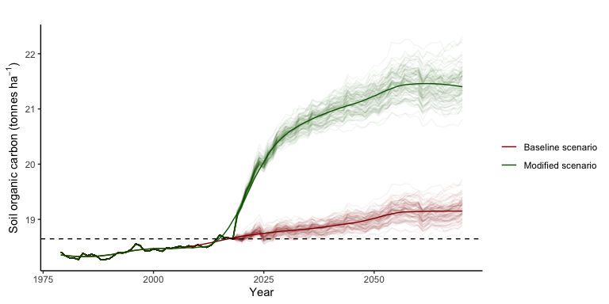

MSc Soil Science Concepts & Applications Modelling Tutorial
================
Dr Alasdair Sykes
23/03/2020

## Overview

For your modelling tutorial, you will be using a globally parameterised
steady-state soil C model to make predictions about soil carbon dynamics
in an agricultural setting. The scenario you will be modelling is based
on barley production at Bush Estate farm, near Penicuik. You will use
the model to set up a number of different management scenarios, and to
make predictions about what effect these management practices would have
on soil carbon stocks for the land in question.

## How does the model work?

The model is a simplified, three-pool soil carbon model. These three
pools are differentiated primarily by different decay rates (i.e. rates
at which soil carbon is lost, via microbial mineralisation, to the
atmosphere as CO2). These pools are:

1.  The active pool, which varies the most year on year, and has the
    highest rates of inputs and decay. It is fed by organic C inputs and
    by the slow and passive pools.

2.  The slow pool, which varies less than the active pool and has lower
    decay rates. It is fed by the active pool and by organic C inputs.

3.  The passive pool, which has the slowest rates of input and decay. It
    is fed by the active and slow pools only—it does not receive any
    direct organic C inputs.

The model simulates the flow of organic carbon into, out of and between
these pools. The result can be used to estimate the net removal or
addition of CO2 to or from the atmosphere. Environmental
parameters for the model include monthly temperature, monthly
precipitation, monthly potential evapotranspiration and soil sand
fraction. Management related parameters include C inputs from crops,
lignin and N content of organic matter, tillage practices and manure
inputs. All of these things affect how quickly the pools gain and lose
carbon, and how carbon flows between them.

Full details of the model implementation can be found in Chapter 5 of
[this
document](https://www.ipcc-nggip.iges.or.jp/public/2019rf/vol4.html).
It’s somewhat heavy going, but it will answer any and all questions
you may have about the intricacies of the model.

## How is this scenario set up?

This scenario has been set up for barley production on Bush Estate farm
(SRUC’s campus farm near Penicuik, south of Edinburgh) for the years
1980 to 2070. Since the model relies greatly on climate parameters, I
have used a mixture of historical data (up to 2019) and climate
predictions (2020–2070) to set up this implementation of the model.
Future climate is uncertain, so from 2019 onwards, you will see the
model run multiple (*n* = 100) scenarios which capture this uncertainty.
We could easily run more scenarios, but 100 makes for a good balance
between insight and computational demand.

Climate prediction data are sourced from the UKCP and can be found
[here](https://www.metoffice.gov.uk/research/approach/collaboration/ukcp/download-data).

In this implementation, the model utilises three main data files. These
are found in the **model-data** folder and are as follows:

1.  Crop data (default file =
    **bush-estate-barley-crop-data-1980-2070.csv**). This file tells the
    model what crop is being grown, how much yield it produces, and what
    management practices are used. This file can be opened, viewed and
    edited easily using MS Excel or any other spreadsheet program.

2.  Manure data (default file =
    **bush-estate-manure-application-1980-2070.csv**). This file tells
    the model what manure is used, and how much (if any) is applied.
    This file can also be opened, viewed and edited easily.

3.  Climate data (default file =
    **bush-estate-1980-2070-climvars-100-samples.rds**). This file tells
    the model what the climate is like over the duration of the model
    run (precipitation, temperature and so on). It is saved in a .rds
    format (R’s native file format) as it is quite large and complex.
    You aren’t intended to open, view or modify this file for this
    tutorial\!

To create new model scenarios, you will manually modify the first two
files. For details on how to do this, refer to the **Model Scenarios —
Your Tasks** section, below.

## Getting started

This tutorial will involve using R and RStudio. For those of you who are
less than confident in this environment, fear not—it is entirely
possible to complete the tutorial, and its learning objectives, to a
high standard **without** doing any coding whatsoever. For those R
enthusiasts amongst you, you will have all of the code with which this
model was built and executed, and you play with it as much as you like.

Regardless of where you are on the R enthusiasm scale, you need to make
sure of the following before you start:

1.  You have R version 3.6.2 or higher installed on your computer. You
    can check the version of R you are running by typing
    `R.version.string` into the console, and R will return the version
    for you. If you are not running v3.6.2 (or you don’t have R
    installed at all), [this
    page](https://uvastatlab.github.io/phdplus/installR.html) provides
    install links for Windows and MacOS.

2.  You have RStudio version 1.2.5033 or higher installed on your
    computer. You can check this by opening RStudio and going to ‘About
    RStudio’ on the top menu (the exact location varies depending on
    Mac/Windows layouts). If you don’t have this version installed, you
    can find the install link for Mac and Windows
    [here](https://rstudio.com/products/rstudio/download/#download).

3.  You have the `tidyverse` and `shiny` packages installed and up to
    date. This is crucial—the model won’t run without this step\! This
    simplest way to check this is to type
    `install.packages(c("tidyverse", "shiny"))` into the console and hit
    return. If you don’t have them installed, this will install them; if
    you do, it’ll update them as necessary.

> Note: I realise it’s annoying to go through these steps before
> starting. It’s good practice to update your R/RStudio versions
> regularly—it saves annoying errors and time wasted trying to figure
> out why. If you really want to skip the first two steps, you can, but
> if anything goes wrong when running the model, please come back to
> this stage and update everything as a first port of call. The last
> step (installing your packages) is not optional, and all you will see
> is an error message if you skip this one.

## Using the model

For instructions on using the model, you should refer to the screen
recording also included in your download folder, where a walkthrough
demonstration of opening and usign the the model is provided. As a quick
reminder, here are the steps you need to go through to run the Shiny app
version of the model:

1.  Open RStudio.

2.  In the top right-hand corner of RStudio, click the dropdown arrow
    next to where it says **Project: None** (note, if you already have
    an RStudio Project open, it’ll say the name of that project instead
    of **Project: None**. Close it now if this is the case. If you don’t
    know what an RStudio Project is, don’t worry about it\!).

3.  Click **Open Project** and navigate to the folder where you’ve saved
    and extracted the tutorial download. Double click on the **.RProj**
    file to open it (it’ll be the only one in the folder that’s not
    greyed out).

4.  Click to the files tab in your bottom right-hand window, and click
    on the file entitled **app.R**.

5.  When **app.R** opens in your main window, look for the green *Play*
    button on the top right of that window, with **Run App** written
    next to it. Click that button and the model UI will launch.

6.  You are now ready to set up and run model scenarios using the data
    input tools provided. Refer to the screen recording for a full
    walkthrough of this process.

## Model Scenarios — Your Tasks

Once you have familiarised yourself with using the model, try modifying
the model to analyse the following scenarios:

1.  Open the default manure input data
    (**model-data/bush-estate-manure-application-1980-2070.csv**). Use
    it as a basis to create a manure input .csv file where, from 2020
    until 2070, the manure N inputs (column `man_nrate`) are 50 kg N
    ha-1 year-1, and the manure type (column
    `man_type`) is “Beef cattle”. Save it in the **model-data** folder
    with a new name, and use this as the manure input file for your
    modified scenario. Compare it to the baseline scenario (manure N
    inputs = 0 kg N ha-1 year-1). What difference
    does it make?

2.  Create some more versions of this manure input file with different N
    rates and different manure types. Use the model parameter file
    **parameter-data/manure-coefficients.csv** to see what other types
    of manure the model will recognise. What difference do they make?
    Which manure is the most effective for soil carbon sequestration?

3.  Try creating a scenario where the crop residues are left on the
    field, rather than being removed. Open the default crop data input
    file **model-data/bush-estate-barley-crop-data-1980-2070.csv** and
    modify the `frac_remove` column so that from 2020 onwards,
    `frac_remove` (short for fraction of crop residues removed) is equal
    to zero. Save it in **model-data** under a new name, and use it to
    run the modified scenario in your model. Does it make much
    difference to the soil carbon stocks?

4.  Model a switch to reduced or zero tillage from 2020 onwards. You
    should have noticed the tillage column in the default crop data
    input (**model-data/bush-estate-barley-crop-data-1980-2070.csv**).
    Other tillage types recognised by the model are `reduced` and
    `zero`.

5.  The model also recognises different crops. Open the file
    **parameter-data/crop-N-and-lignin-fractions.csv** to see which it
    recognises. What if Bush Estate rotated barley with alfalfa every
    four years from now until 2070? Try modelling it—you can assume a
    yield of 15 tonnes ha-1 year-1 and a
    `frac_remove` of 0.7.

6.  *“You’re the soil scientists…. You figure it out\!”* By now you
    should have a pretty good idea of what the model can do. Use what
    you’ve learned to try and figure out an optimal scenario for C
    sequestration on Bush Estate’s barley enterprise. Be reasonable and
    realistic\! The model is only as good as its inputs, and it won’t
    keep you right if you tell it you’re putting 2000 tonnes
    ha-1 of manure nitrogen on your land. If you need a good
    source for realistic farm data and practices, the SAC Farm
    Management Handbook can be read online
    [here](https://www.fas.scot/publication/farm-management-handbook-2019-20/).

7.  How can you best present the results of what you’ve done? The model
    gives you some default output data and plots, but also the option to
    export your raw data. Open this up in a spreadsheet program and play
    with some visualisations.

## Your lab report

Your lab report should include the following:

1.  A summary of the model scenarios you ran (1–7 in the above section
    **Model Scenarios — Your Tasks**) including input data values used,
    and model outputs. The latter can include numeric outputs,
    app-generated plots (you can screengrab these from the app), and
    plots you’ve made yourself using data exported from the model.

2.  A detailed description of your ‘optimal’ scenario (number 6 in the
    above section). What final system did you define? How did you arrive
    at this system? What is your view, as a soil scientist, of what the
    model is telling you? Does it seem realistic?

3.  An answer to the following question: *How could this implementation
    of this model be validated against real-world data*? Use what you
    know about model validation (think last week’s slides) and soil
    science to answer this question. Be as specific as you like, but try
    to keep in mind realistic constraints (e.g. on data collection,
    laboratory analysis, and so on).

## For the ambitious

Some (optional) tasks to tax the skills of any R/modelling geeks out
there:

1.  The baseline crop data
    (**model-data/bush-estate-barley-crop-data-1980-2070.csv**) is
    created using the R script **barley-yield-simulation.R**. It has
    been done using a very simple method. Can you improve it?

2.  The system climate data used by the model is saved as
    **model-data/bush-estate-1980-2070-climvars-100-samples.rds**.
    Though modifying it isn’t necessary for this tutorial, open it up in
    R and see how it looks. How about trying a basic sensitivity test of
    the model’s reliance on climate by raising and lowering the monthly
    average temperature by 1oC?

## That’s all folks

I hope this makes for an interesting session. Feel free to play with the
model as much as you like, and experiment with its capabilities. You are
the guinea pigs for this session, since no-one else has gone before. I’d
very much like to hear what you think of it — so any feedback,
questions, comments or queries, please don’t hesitate to drop me an
email.
